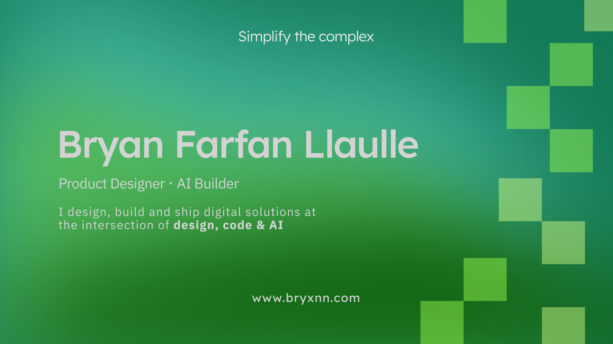

<div align="center">
  
</div>

<div align="center">

# Hey, I'm Bryan Farfan

### Design Engineer · AI Builder

**I design, build and ship digital products at the intersection of design, code & AI.**

🇵🇪 Lima, Peru

<br>

<a href="https://cmdeboraservices.my.canva.site/portafolio-bryan-farfan-llaulle/#home">

</a>
<a href="https://www.linkedin.com/in/bryan-farfan-llaulle/">

</a>
<a href="https://github.com/bryfar">

</a>

</div>

---

## ◈ About

I'm a **Product Designer turned Design Engineer**, currently exploring the intersection of **AI, frontend engineering and product design**.

I enjoy taking ideas from **concept → interface → code → working product**.

* ◇ Product design, UX/UI & design systems
* ◇ Frontend engineering & creative development
* ◇ AI-native products, LLMs & agents
* ◇ Design-to-code workflows
* ◇ Prototyping, shipping & building in public
* ◇ Based in Lima, Peru 🇵🇪

> **I don't just design products. I like building them.**

---

## ◆ What I'm building

```text
Design Engineering    ████████████████████░
AI Products            ██████████████████░░
Creative Development   ████████████████░░░░
Developer Tools        ██████████████░░░░░░
Open Source            ████████████░░░░░░░░
```

Currently exploring:

**AI-native interfaces · LLMs · AI agents · React · Next.js · Design Systems · Developer Tools**

---

## ◆ Selected projects

<table>
<tr>
<td width="50%" valign="top">

### ◇ Buildev

**AI-native design-to-code platform**

Visual canvas + IDE workflows, multi-framework code export and AI-powered development.

`TypeScript` `AI` `Design Tools`

<br>

<a href="https://github.com/bryfar/Buildev">

</a>

</td>

<td width="50%" valign="top">

### ◇ Open-Studio

**Browser-based video editor**

A powerful web video editor with timeline, multi-track editing, screen recording, motion graphics, keyframes and video export.

`TypeScript` `Web` `Creative Tools`

<br>

<a href="https://github.com/bryfar/Open-Studio">

</a>

</td>
</tr>

<tr>
<td width="50%" valign="top">

### ◇ Stark

**Open-source coding agent for Linux**

Exploring developer tools, local workflows and AI-assisted software development.

`JavaScript` `AI` `Developer Tools`

<br>

<a href="https://github.com/bryfar/stark">

</a>

</td>

<td width="50%" valign="top">

### ◇ Experiments

Small experiments where I explore new interfaces, AI workflows, creative coding and product ideas.

`AI` `UX` `Prototyping` `Code`

<br>

<a href="https://github.com/bryfar?tab=repositories">

</a>

</td>
</tr>
</table>

---

## ⌁ My path

```text
Marketing
    ↓
UX / UI Design
    ↓
Product Design
    ↓
Design Engineering
    ↓
AI Engineering
```

My background started in **marketing and communication**, moved into **UX/UI and product design**, and is now evolving toward **design engineering and AI product development**.

That combination shapes how I build:

**Understand the problem → design the experience → build the interface → integrate intelligence → ship.**

---

## ⌘ Tech & tools

### Design

<p>

</p>

`UX/UI` · `Design Systems` · `Prototyping` · `Accessibility`

### Frontend & Engineering

<p>

</p>

### AI & Development

<p>

</p>

`LLMs` · `AI SDKs` · `AI Agents` · `Prompt Engineering`

### Workflow

`Figma` · `Cursor` · `GitHub` · `Google AI Studio` · `Vibe Coding`

---

## ◇ What I care about

> **Good software should feel obvious.**

* → Clear product thinking
* → Interfaces that reduce cognitive load
* → Accessible experiences
* → Design systems that scale
* → AI that solves real problems
* → Fast iteration
* → Developer experience
* → Shipping over endlessly planning

---

## ◌ GitHub activity

<div align="center">


</div>

---

<div align="center">

### Build in public. Ship often. Learn always.

<br>

`DESIGN × CODE × AI`

<br><br>

<a href="https://github.com/bryfar?tab=repositories">

</a>

</div>
